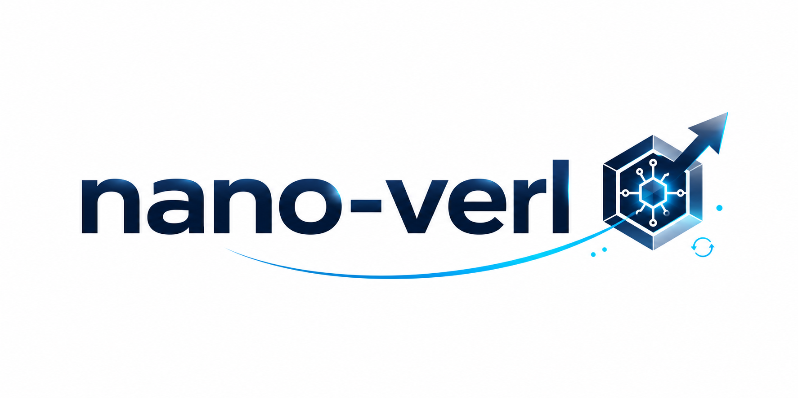
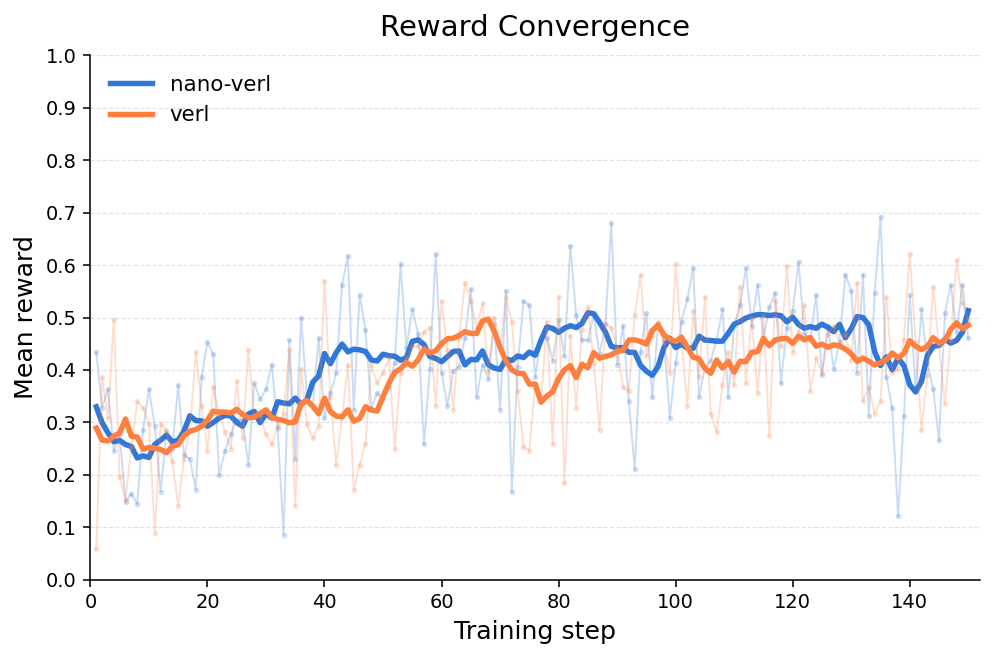

# nano-verl

[中文版](README_CN.md)

A lightweight `verl`-style RL training framework implemented from scratch.

## Core Features

1. **Readability**: `nanoverl` has about 6k lines of code, compared with 90K+ lines in `verl`.
2. **Distributed training**: uses `FSDP+vLLM` as the training and inference backends, with `Ray` for distributed management. Supports `rollout load balancing`, `dynamic batch`, `remove padding`, and more.
3. **Asynchronous support**: supports `one-step-off-policy` asynchronous training, enabled by setting `trainer.mode=one_step_off`.

## Installation

1. Clone the code:

```bash
git clone 
cd nano-verl
```

2. Install dependencies with `uv`:

```bash
uv sync
```

3. Find the compatible [`flash-attn` wheel](https://github.com/Dao-AILab/flash-attention/releases) and install it separately:

```bash
uv run pip install <flash_attn_wheel_url>
```

## Quick Start

Train `qwen3-0.6B` on the `gsm8k` dataset:

```bash
uv run python main.py --config configs/gsm8k-qwen3-0.6b-single-gpu.yaml
```

You can also train `qwen3-1.7B` asynchronously on two GPUs:

```bash
uv run python main.py --config configs/gsm8k-qwen3-1.7b-1p1-async.yaml
```

## Benchmark

**Test configuration:**

- Model: Qwen3-4B
- Trainset: DAPO-17K
- Reward: 1/-1 accuracy reward
- Steps: 150
- Global batch size: 64
- Rollout n: 8
- Prompt length: 1024
- Response length: 8192
- Hardware: 1 node, 8 x NVIDIA H100 80GB HBM3

**Reward curve:**



**Performance comparison:**

| Setting             | AIME24 avg16 | AIME24 pass@16 | AIME25 avg16 | AIME25 pass@16 |
| ------------------- | -----------: | -------------: | -----------: | -------------: |
| Qwen3-4B Base        |       0.4333 |         0.7000 |       0.3563 |         0.5333 |
| Qwen3-4B + verl      |       0.5313 |         0.8333 |       0.4417 |         0.6667 |
| Qwen3-4B + nano-verl |        0.535 |         0.8333 |        0.429 |         0.6667 |
